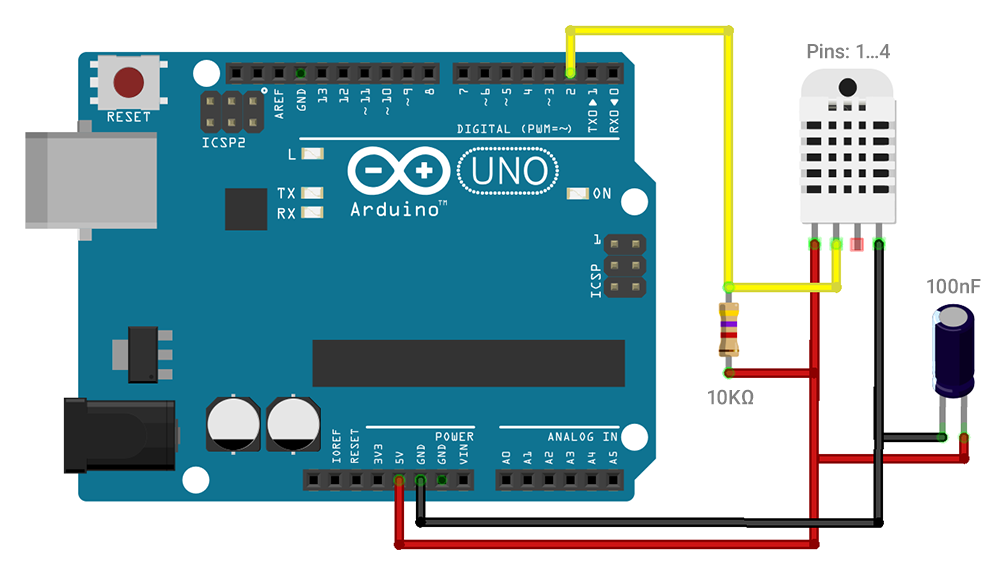

# DHT-22

Low cost DHT temperature & humidity sensors.  
These sensors are very basic and slow, but are great for hobbyists who want to do some basic data logging.

## Measures

- Temperature (in Celsius)
- Humidity (in percent)

## Specifications

- Power supply: 3.3–6V DC
- Current supply:
  - Measuring: 1~ 1.5mA
  - Standby: 40~50µA
- Output signal: Digital signal via single bus
- Sensing element: Polymer capacitor
- Sensing period: 2s (average)
- Temperature
  - Operating range: -40~80°C
  - Accuracy: <±0.5°C
  - Sensitivity: 0.1°C
  - Repeatability: ±0.2°C
- Humidity:
  - Operating range: 0-100%RH
  - Accuracy: ±2%RH (max ±5%RH)
  - Sensitivity: 0.1%RH
  - Repeatability: ±1%RH
  - Hysteresis: ±0.3%RH
  - Long-term stability: ±0.5%RG/year
- Attention: Welding temperature should be below 260°C

[Data Sheet](https://cdn.shopify.com/s/files/1/1509/1638/files/DHT_22_-_AM2302_Temperatur_und_Luftfeuchtigkeitssensor_Datenblatt.pdf?11983326290748777409) (from AZ-Delivery)

## Pins

It has four pins (from left to right):

1. VCC (red wire) – Connect to 5V power.
2. Data out (white or yellow wire) – Connect to a digital pin.
3. _Not connected_
4. Ground (black wire)

## Schematics

## Related Information

### Libraries

- [Adafruit's DHT sensor library](https://github.com/adafruit/DHT-sensor-library)

### Parts

- A **10KΩ resistor** can be placed between VCC and data pin to act as a medium-strength pull up on the data line. The Arduino has built in pullups you can turn on but they're very weak, about 20-50K. DHT-22 often have a pullup already inside, but it doesn't hurt to add another one!
- A **100nF capacitor** can be added between VCC and ground for wave filtering.

## Tutorials

- [Adafruit](https://learn.adafruit.com/dht)
- [Arduino](https://create.arduino.cc/projecthub/mafzal/temperature-monitoring-with-dht22-arduino-15b013)
